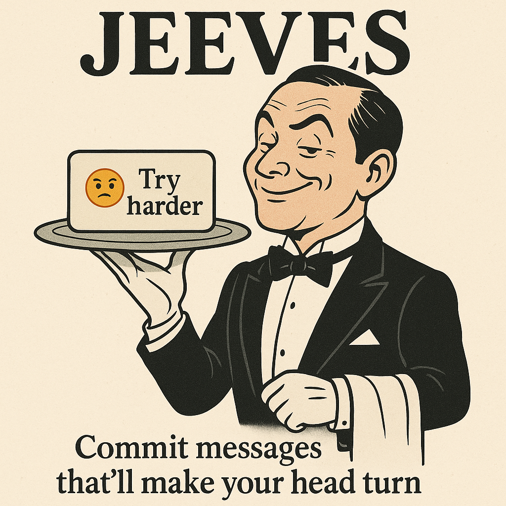

# Jeeves

<p align="center">
  
</p>

Jeeves creates Git commit messages from your changes using OpenRouter or a
local Ollama model. The bundled prompt adds gitmoji and a sarcastic roast of
your engineering choices. Your own prompt can be neutral.

```text
🐛 fix(client): retry only rate limits and server errors

Stop retrying permanent client errors. Asking a 404 more insistently was
never going to make the missing endpoint appear.
```

## Install

Use Ruby 3.3 through 4.0 and Git. Development uses the version in `.ruby-version`.

```sh
gem install jeeves-git-commit
```

From a source checkout:

```sh
bundle install
bundle exec rake install
```

Alternatively, `./install.sh` links this checkout's executable into your PATH.
The checkout must remain available when using this installation method.

## Configure

For OpenRouter, export `OPENROUTER_API_KEY`. Optionally set `GIT_COMMIT_MODEL`
to your preferred model. The provider defaults to OpenRouter.

To use an installed local Ollama model, save these in your shell's configuration
or the environment file your shell already loads:

```dotenv
GIT_COMMIT_PROVIDER=ollama
GIT_COMMIT_LOCAL_MODEL=your-installed-model
```

Plain `jeeves` then uses local generation; no per-command flag or cloud key is
needed. See [configuration](docs/configuration.md) for installation, fish
syntax, all settings, prompt customization, and input limits.

Version 3 requires Ruby 3.3 through 4.0. It validates conventional commit
subjects by default; use `GIT_COMMIT_MESSAGE_FORMAT=plain` for a custom format.
Existing personal prompts are preserved. See the [release notes](docs/releases.md).

## Use

```sh
# Generate and commit the staged changes
jeeves

# Stage all changes, then generate and commit
jeeves --all

# Inspect the message without staging, committing, or pushing
jeeves --dry-run
jeeves --all --dry-run

# Generate from a supplied diff; only the message goes to stdout
git diff | jeeves

# Push only after a successful commit
jeeves --push

# Use the saved cloud model for one command
jeeves --provider openrouter

# Override the local model for one command
jeeves --local --model another-installed-model
```

| Option | Purpose |
| --- | --- |
| `-a`, `--all` | Include all working-tree changes |
| `-d`, `--dry-run` | Print the message without changing the real index or HEAD |
| `-p`, `--push` | Push after a successful commit |
| `--provider openrouter\|ollama` | Override the provider |
| `--local` | Use Ollama for this invocation |
| `--model MODEL` | Override the selected provider's model |
| `--version` | Print the version |
| `-h`, `--help` | Print help |

Git and generation failures stop the command with a nonzero exit status.
Jeeves checks that staged changes and HEAD still match what it reviewed before
committing. See [architecture and Git behavior](docs/architecture.md).

## Develop

```sh
bin/setup
bundle install
bundle exec rake test
bundle exec rake lint
bundle exec rake build
bin/check --full
bin/doctor
```

`bin/check` runs fast foundation checks. `bin/check --documents-only` checks
Markdown. `bin/check --full` adds the foundation tests and Ruby tests, lint,
and gem build. Application checks are not part of the two routine modes.
Built gems go in `gems/`. Publishing with `rake push` is an explicit release
action; it is never part of normal validation.

- [Development workflow](docs/development-workflow.md): setup, knowledge search,
  worktrees, hooks, runtime policy, and validation.
- [Documents](docs/README.md) and [memory](memory/README.md).
- [GitHub Issues](https://github.com/jubishop/Jeeves/issues): bugs and planned work.
- [Agent instructions](AGENTS.md).
- [Repository checks](.github/workflows/check.yml).

## License

Jeeves uses the [MIT license](LICENSE). The adopted project foundation retains
its separate [license notice](LICENSE.project-starter).
